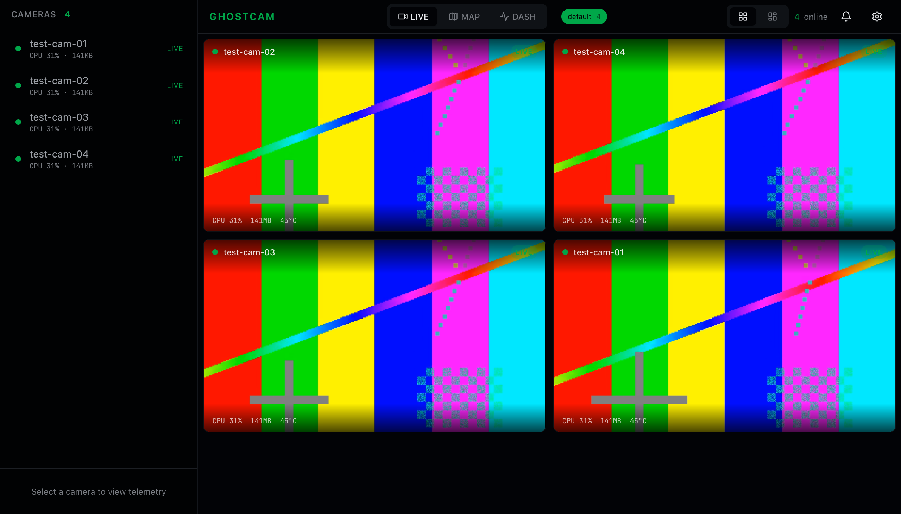

# Ghostcam

Real-time camera surveillance system. Cameras stream H.264 video and Opus audio over QUIC to a bridge server, which translates to WebRTC for browser-based viewing. Cameras are organized into groups; viewers subscribe to a group and receive all feeds over a single PeerConnection.



## Architecture

```
                           ┌──────────────────────────────────────┐
                           │            ghostcam-bridge           │
┌─────────────┐   QUIC     │                                      │   WebRTC    ┌─────────────┐
│  Camera 1   │───────────>│  QUIC Listener ──> GroupRouter ──>   │──────────>  │   Browser   │
│  (agent)    │  H.264     │                    broadcast    RTP  │   RTP       │   Viewer    │
└─────────────┘  + Opus    │                        │         │   │             └─────────────┘
                           │                        ▼         ▼   │
┌─────────────┐   QUIC     │               SPS/PPS cache   str0m  │   HTTP      ┌─────────────┐
│  Camera 2   │───────────>│                  (ICE-lite)          │<──────────  │  API Client │
│  (agent)    │            │                       │              │   SDP       └─────────────┘
└─────────────┘            │                       ▼              │
                           │                  Data Channel        │
┌─────────────┐   QUIC     │               (telemetry, events)    │
│  Camera N   │───────────>│                                      │
│  (agent)    │            │              Axum HTTP API           │
└─────────────┘            │         (SDP exchange, REST)         │
                           └──────────────────────────────────────┘
```

### Crates

| Crate | Role |
|-------|------|
| `ghostcam-common` | Shared types — 13-byte frame wire format, `DeviceHello` handshake, hierarchical `GroupId`, config constants |
| `ghostcam-agent` | Test camera client — QUIC connection, loops H.264 file + Opus silence at target FPS |
| `ghostcam-bridge` | Bridge server — QUIC listener, `GroupRouter`, H.264/Opus RTP packetizer, str0m WebRTC engine (ICE-lite), Axum HTTP API, data channel events |

### Viewer

Svelte 5 SPA in `viewer/` — pure WebRTC transport (no WebSocket fallback), data channel for camera events and telemetry, Tailwind CSS 4, bits-ui components, lucide-svelte icons.

## Quick Start

### Prerequisites

- Rust toolchain ([rustup](https://rustup.rs/))
- [Bun](https://bun.sh/) (for viewer dev server)
- FFmpeg (for generating test video)

### 1. Generate test video

```bash
mkdir -p test-data
ffmpeg -f lavfi -i testsrc2=duration=10:size=640x480:rate=30 \
  -c:v libx264 -profile:v baseline -x264-params keyint=60:min-keyint=60 \
  -f h264 test-data/test.h264
```

This creates a 10-second 640x480 H.264 Baseline profile test pattern with keyframes every 2 seconds (60 frames at 30fps).

### 2. Build everything

```bash
cargo build
cd viewer && bun install && cd ..
```

### 3. Run the bridge

```bash
cargo run -p ghostcam-bridge -- --public-ip 127.0.0.1
```

The bridge starts:
- QUIC listener on `0.0.0.0:4433/udp` (camera ingress)
- HTTP API on `0.0.0.0:3000/tcp` (viewer API + optional static files)
- WebRTC engine on a random UDP port (media egress)

### 4. Run a test camera

```bash
cargo run -p ghostcam-agent -- \
  --bridge-addr 127.0.0.1:4433 \
  --device-id cam-01 \
  --group-id default
```

The agent connects via QUIC, sends a `DeviceHello`, then streams H.264 NAL units and Opus silence frames continuously.

### 5. Start the viewer

```bash
cd viewer
bun run dev
```

Open http://localhost:5173 in your browser. The viewer's Vite dev server proxies `/api` requests to the bridge on port 3000.

### Multi-camera test

```bash
./scripts/launch-cameras.sh 4 default
```

Launches 4 test cameras (`test-cam-01` through `test-cam-04`) in group `default`. Environment variables: `BRIDGE_ADDR`, `FPS`, `TEST_FILE`.

## Configuration

### Bridge CLI

| Flag | Env | Default | Description |
|------|-----|---------|-------------|
| `--quic-port` | | `4433` | QUIC listen port for cameras |
| `--http-port` | | `3000` | HTTP API port |
| `--public-ip` | | `127.0.0.1` | Public IP for ICE host candidates |
| `--api-key` | `GHOSTCAM_API_KEY` | `dev-key` | Bearer token for API auth |
| `--viewer-dir` | | _(none)_ | Serve built viewer static files |

### Agent CLI

| Flag | Default | Description |
|------|---------|-------------|
| `--bridge-addr` | `127.0.0.1:4433` | Bridge QUIC address |
| `--device-id` | `test-cam-01` | Camera device identifier |
| `--group-id` | `default` | Group to join |
| `--test-file` | `test-data/test.h264` | Raw H.264 Annex-B file |
| `--fps` | `30` | Target frame rate |

### Logging

Both binaries use `tracing-subscriber` with `RUST_LOG` env filter:

```bash
RUST_LOG=ghostcam_bridge=debug,str0m=warn cargo run -p ghostcam-bridge -- --public-ip 127.0.0.1
RUST_LOG=ghostcam_agent=debug cargo run -p ghostcam-agent
```

## Ports

| Port | Protocol | Service |
|------|----------|---------|
| 4433 | UDP | QUIC — camera agent to bridge |
| 3000 | TCP | HTTP API + static viewer (production) |
| 5173 | TCP | Vite dev server (development only) |
| _random_ | UDP | WebRTC media — bridge to browsers |

## HTTP API

All endpoints except health checks require `Authorization: Bearer <api-key>`.

### Session Management

**Create session** — `POST /api/v1/watch/{group_id}`
```
Request:  SDP offer (text/plain body)
Response: 201 Created
          { "session_id": "...", "sdp_answer": "..." }
```

**Delete session** — `DELETE /api/v1/session/{id}`
```
Response: 200 OK
```

**Trickle ICE** — `POST /api/v1/session/{id}/ice`
```
Request:  ICE candidate string (text/plain body)
Response: 200 OK
```

### Discovery

**List groups** — `GET /api/v1/groups`
```json
[{ "group_id": "default", "camera_count": 4 }]
```

**List cameras** — `GET /api/v1/groups/{group_id}/cameras`
```json
[{
  "device_id": "cam-01",
  "group_id": "default",
  "capabilities": ["h264", "opus"],
  "connected_at": 1709500000
}]
```

### Health

- `GET /healthz` — always `200 OK` (no auth)
- `GET /readyz` — `200 OK` (no auth)

## Wire Protocol

### QUIC (Camera to Bridge)

**Control stream** (bidirectional, opened by camera):
```
[4 bytes: JSON length (u32 BE)] [JSON: DeviceHello]
```

`DeviceHello`:
```json
{
  "device_id": "cam-01",
  "group_id": "default",
  "capabilities": ["h264", "opus"]
}
```

**Frame streams** (unidirectional, one per frame):
```
┌──────────────┬───────────────────┬──────────────────┬─────────┐
│ stream_type  │   timestamp_us    │   payload_len    │ payload │
│   (1 byte)   │   (8 bytes BE)    │   (4 bytes BE)   │  (var)  │
└──────────────┴───────────────────┴──────────────────┴─────────┘
```

- `stream_type`: `0` = video (H.264 NAL unit), `1` = audio (Opus frame)
- `timestamp_us`: Microsecond presentation timestamp
- `payload_len`: Payload byte count
- Max frame size: 1 MB

### WebRTC (Bridge to Browser)

- **Video**: H.264 RTP (RFC 6184) — Single NAL Unit packets for NALs ≤ 1188 bytes, FU-A fragmentation for larger. 90kHz clock.
- **Audio**: Opus RTP (RFC 7587) — One packet per frame. 48kHz clock.
- **Data channel** ("telemetry"): JSON messages for camera events and metrics.

### Data Channel Messages

```jsonc
// Full camera list (sent on session creation)
{ "type": "cameras", "cameras": [{ "device_id": "...", "group_id": "...", "capabilities": [...] }] }

// Camera joined group
{ "type": "camera_join", "device_id": "...", "group_id": "...", "capabilities": [...] }

// Camera left group
{ "type": "camera_leave", "device_id": "..." }

// Periodic telemetry (every 2s)
{ "type": "telemetry", "device_id": "...", "cpu_percent": 28.0, "temp_celsius": 44.0, "memory_mb": 128.0, "uptime_secs": 3600 }

// Request SDP renegotiation
{ "type": "renegotiate", "sdp_offer": "..." }
```

## Group IDs

Groups use colon-separated hierarchical identifiers: `usr-alice:perimeter`, `usr-alice:perimeter:north`. A group is an ancestor of another if the child's ID starts with `parent:`. The `parent()` method strips the last segment.

## Viewer Features

- Multi-camera grid with responsive auto-fit and 1+5 featured layouts
- Fullscreen single-camera view with keyboard shortcuts (F/M/S/P/Esc)
- Live telemetry display with sparkline graphs (CPU, memory, temperature)
- Camera group switching
- Inline camera renaming
- Picture-in-Picture and snapshot capture
- Connection alerts (disconnect/reconnect notifications)
- Dark/light/system theme
- Mobile responsive (sidebar + mobile nav)

## Docker

```bash
docker compose up
```

Runs bridge + 2 test cameras. Requires a `Dockerfile` with `bridge` and `agent` build targets.

## Project Structure

```
ghostcam/
├── Cargo.toml                    # Workspace root
├── ghostcam-common/src/
│   ├── lib.rs
│   ├── frame.rs                  # 13-byte wire format encode/decode
│   ├── hello.rs                  # DeviceHello handshake
│   ├── group.rs                  # Hierarchical GroupId
│   └── config.rs                 # Port/MTU constants
├── ghostcam-agent/src/
│   ├── main.rs                   # CLI, connect, stream loop
│   ├── quic.rs                   # Quinn QUIC client + self-signed TLS
│   ├── stream.rs                 # send_video_frame, send_audio_frame
│   └── test_source.rs            # H.264 Annex-B NAL parser
├── ghostcam-bridge/src/
│   ├── main.rs                   # CLI, AppState, task spawning
│   ├── quic.rs                   # QUIC listener, camera handler
│   ├── router.rs                 # GroupRouter, broadcast, SPS/PPS cache
│   ├── rtp.rs                    # H.264 FU-A packetizer, timestamp math
│   ├── webrtc.rs                 # str0m WebRTC engine, session mgmt
│   ├── api.rs                    # Axum HTTP routes + auth middleware
│   └── data_channel.rs           # DataChannelMessage types
├── viewer/
│   ├── package.json
│   ├── vite.config.ts
│   └── src/
│       ├── App.svelte
│       ├── lib/
│       │   ├── signaling.ts      # HTTP signaling client
│       │   ├── webrtc.ts         # RTCPeerConnection manager
│       │   ├── data-channel.ts   # Message dispatcher
│       │   ├── types.ts
│       │   ├── stores/           # Svelte 5 reactive state
│       │   ├── views/            # LiveView, CameraView
│       │   └── components/       # UI components
├── test-data/test.h264
├── scripts/launch-cameras.sh
└── docker-compose.yml
```

## Key Dependencies

| Dependency | Version | Purpose |
|------------|---------|---------|
| str0m | 0.6 | Sans-I/O WebRTC library (ICE-lite mode) |
| quinn | 0.11 | QUIC transport |
| axum | 0.7 | HTTP framework |
| rustls | 0.23 | TLS for QUIC |
| rcgen | 0.13 | Self-signed certificate generation |
| tokio | 1 | Async runtime |
| svelte | 5 | Frontend framework (runes reactivity) |
| tailwindcss | 4 | CSS framework (OKLCH colors) |
| bits-ui | 2 | Headless UI component library |

## License

Private / All rights reserved.
